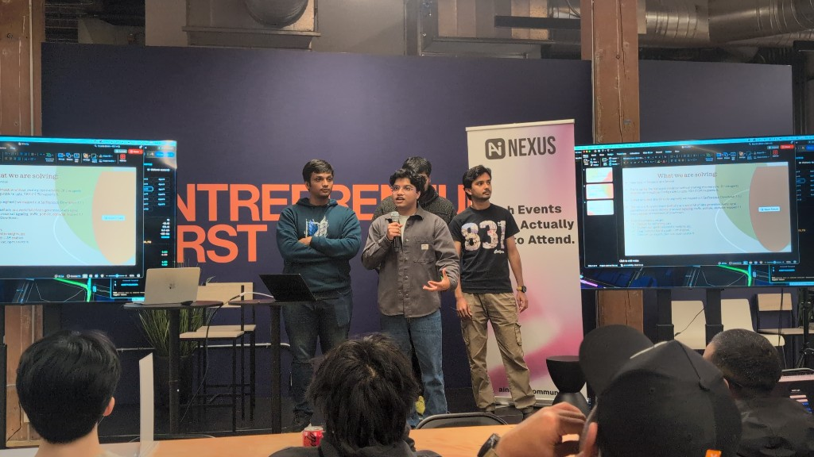
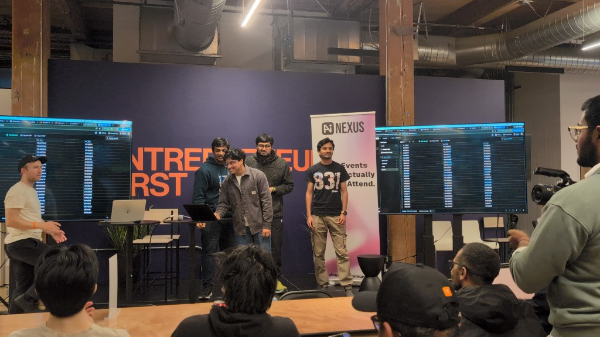

# MoWay — Simulator-as-a-Service for Self-Driving Cars

**Waymo for everyone, open-sourced.**

MoWay is a browser-based reinforcement learning environment that recreates
downtown San Francisco 1:1 and trains autonomous car agents to drive real city
streets — without crashing into anyone. Up to 20 agents drive live and in
real time (configurable to 100+ if your CPU can handle it), each learning to
obey traffic lights, hold their lane, yield to pedestrians, and route
themselves from A to B.

Every drive generates exportable, open self-driving datasets — so the
simulator doubles as a data engine for training real autonomous systems.

---

## Why We Built This

Training a self-driving car in the real world is slow, expensive, and
dangerous. MoWay flips that: spin up a whole city of cars in the browser,
let them crash thousands of times safely, and harvest the data.

- **Simulator-as-a-Service** — train your own fleet of agents in downtown SF.
- **1:1 city** — every signal, crosswalk, building, and one-way street mapped
  from real OpenStreetMap geometry.
- **Open data** — export every (state, action, reward) transition to plot,
  analyze, and train on.
- **The dream** — pluggable hardware that runs these RL paths in *any* car,
  making it autonomous like a Waymo. More cities coming soon.

---

## See It Live

We took MoWay to the InsForge hackathon and placed **top finalist out of 100
teams**.





---

## Highlights

- OSM-derived SF road graph with directed A* routing across real downtown street geometry.
- One-way streets, directional lane counts, and lane-change boundaries enforced per road segment.
- RL agents learn local control on assigned A-to-B routes instead of teleporting or free-roaming off-road.
- Multi-lane roads allow legal lane changes while single-lane roads stay physically constrained.
- Global traffic-light timing on one recurring simulation clock, with synchronized red/yellow/green phases.
- Crosswalk pedestrians follow recurring walk/clearance cycles tied to the same citywide signal pattern.
- Agents observe route progress, lane offset, traffic-light state, crosswalk occupancy, nearby cars, pedestrians, and buildings.
- NPC traffic follows valid directed roads and responds to red lights and occupied crosswalks.
- Currently iterating on a ~20-parameter state tensor, expanding toward 80+.

---

## Tech Stack

| Layer | Technology |
|---|---|
| Map & 3D buildings | MapLibre GL JS (free, no API key) |
| Road, lane & signal data | OpenStreetMap / Overpass extract |
| 3D agents & scene | Three.js (custom MapLibre layer) |
| Physics & collision | Rapier.js (WASM, runs in browser) |
| Web server | Node.js + Express |
| Real-time comms | WebSocket |
| RL backend | Python + PyTorch policy over WebSocket |
| Data & logging | JSONL datasets + Postgres (InsForge) |

---

## How to Run

### Requirements

- [Node.js](https://nodejs.org/en) v18+
- npm (comes with Node)
- Python 3 with `torch` and `websocket-client`

### 1. Install dependencies

```bash
npm install
```

### 2. Start the full dev stack

```bash
npm run dev
```

This clears ports `3000` and `3001`, starts webpack in watch mode, starts the
Express server, starts the WebSocket relay, and launches the Python PyTorch RL
backend.

Then open [http://localhost:3000](http://localhost:3000) in your browser.

### Production build

```bash
npm run build
```

### Start components individually

```bash
npm start
npm run rl:backend
```

The in-app backend indicator should show `backend-connected`, and
`RL controlled` should update as action messages arrive.

### Simulation config

Change `config/simulation.json` to switch fleet size without touching code:

```json
{
  "agentCount": 20,
  "sensorCount": 10
}
```

Restart `npm run dev` after changing the config so both the browser bundle and
Python backend read the same values.

---

## Controls

| Key | Action |
|---|---|
| `W` / `Arrow Up` | Accelerate |
| `S` / `Arrow Down` | Brake / reverse |
| `A` / `Arrow Left` | Steer left |
| `D` / `Arrow Right` | Steer right |
| `C` | Toggle bird's eye / follow camera |

---

## Project Structure

```
/
├── src/
│   ├── index.js              — app bootstrap
│   ├── map/
│   │   ├── mapbox.js         — MapLibre GL JS init, SF downtown view
│   │   ├── RoadGraph.js      — directed OSM road graph and A* route sampler
│   │   ├── sfRoadData.json   — generated SF road, lane, signal, and crossing data
│   │   └── sfLayer.js        — Three.js custom layer injected into MapLibre
│   ├── agents/
│   │   ├── PlayerCar.js      — human-controlled car (WASD)
│   │   ├── CarAgent.js       — single AI agent
│   │   ├── AgentManager.js   — spawns and updates all RL-enabled agents
│   │   ├── NeuralAgent.js    — route-following RL vehicle with lane and traffic-rule observations
│   │   ├── Traffic.js        — global traffic-light clock, crosswalk cycles, peds, and NPC cars
│   │   └── SensorCamera.js   — WebGLRenderTarget front/back/side cameras
│   ├── physics/
│   │   ├── PhysicsWorld.js   — Rapier.js world
│   │   └── Colliders.js      — building + boundary colliders from map data
│   ├── network/
│   │   └── AgentSocket.js    — WebSocket client (observations out, actions in)
│   └── ui/
│       └── CameraToggle.js   — bird's eye and follow camera manager
├── data/
│   └── sf-osm-raw.json       — checked Overpass extract used to generate runtime road data
├── config/
│   └── simulation.json       — shared browser/Python agent and sensor counts
├── server/
│   ├── dev.js                — full dev stack launcher
│   ├── index.js              — Express server, WebSocket relay, and RL backend launcher
│   └── wsRelay.js            — WebSocket relay to RL backend (port 3001)
├── rl/
│   ├── server.py             — PyTorch RL backend
│   └── dataset_logger.py     — logs every transition to exportable JSONL datasets
└── tools/
    └── buildSfRoadData.js    — converts the Overpass extract into strict runtime map data
```

---

## Connecting the RL Backend

The browser sends observations to the RL backend through
`ws://localhost:3001?type=browser`. The PyTorch backend connects through
`ws://localhost:3001?type=rl_backend`.

1. Start the full stack (`npm run dev`)
2. Or start components individually with `npm start` and `npm run rl:backend`
3. Receive observation JSON, send back action JSON per the message format below

**Observation (browser → backend):**
```json
{
  "type": "observations",
  "tick": 1234,
  "agents": [{ "id": 0, "state": [0.0, 0.1, 0.2, 0.3, 0.4, 0.5, 0.6, 0.7, 0.8, 0.9, 0.1, 0.2, 0.3, 0.4, 0.5, 0.6, 0.7, 0.8, 0.9, 1.0], "collided": false, "score": 12.3 }]
}
```

**Action (backend → browser):**
```json
{
  "type": "actions",
  "tick": 1234,
  "agents": [{ "id": 0, "throttle": 0.8, "steering": -0.2, "brake": 0.0 }]
}
```

---

## The Data

Every tick, every agent's `(state, action, reward, events)` transition is
logged to JSONL and bulk-inserted into Postgres. From one product, you get:

- A dataset for self-driving cars.
- Custom car agents with tunable weights and reward shaping.
- An ideal reinforcement-learning path — A* enabled.
- Data you can export, plot, use, and open-source.

---

## Roadmap

- Expand the state tensor from ~20 parameters to 80+.
- Offer the simulator as a service for companies training agents in SF.
- Expand beyond San Francisco to more cities.
- Pluggable hardware to run trained RL paths in real cars.

---

## Credits

- [SynthCity](https://github.com/jeffbeene/synthcity) by Jeff Beene — base Three.js renderer and Bladerunner Sedan model
- Bladerunner Sedan 3D model — Quaz30 ([sketchfab.com/quaz30](https://sketchfab.com/quaz30))
- Map tiles — [OpenFreeMap](https://openfreemap.org/) (free, no API key required)
